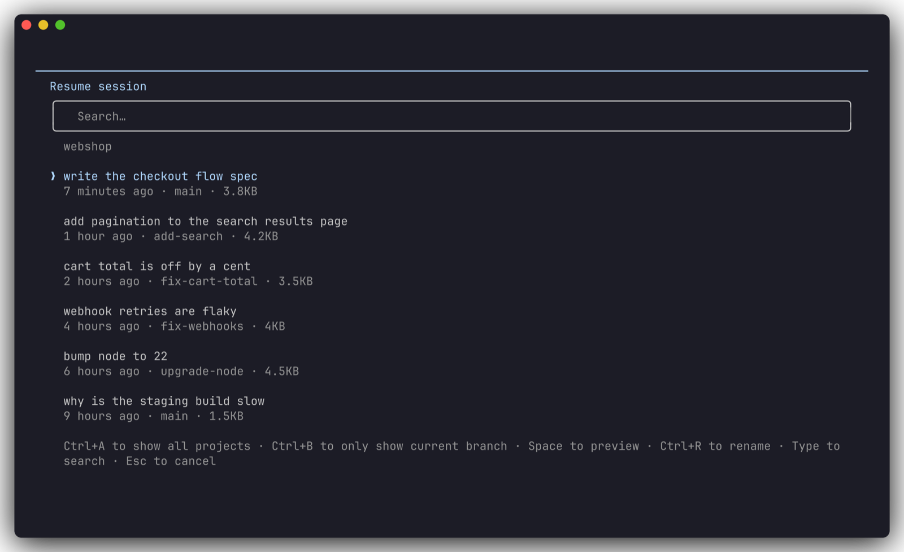
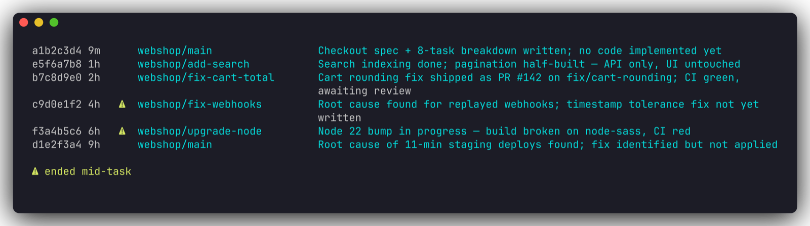
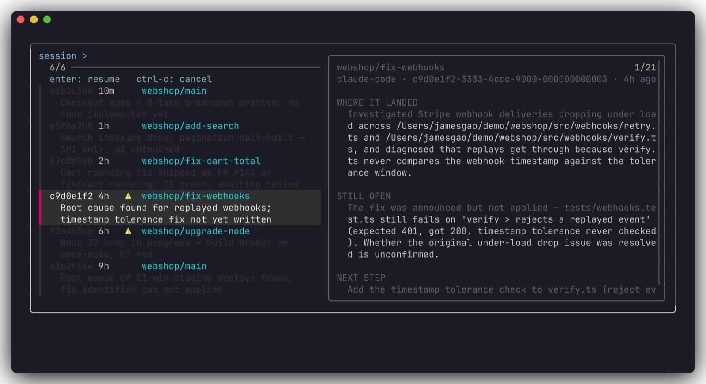

# gigamanage

**Browse, search and resume your AI coding agent sessions — across Claude Code, Codex, and whatever you use next.**

Agent sessions pile up faster than your memory of them does. After a few weeks you have hundreds of transcripts, and the built-in pickers sort them by time and label them with a title generated in the session's *first* few seconds. That title tells you where the work **started**. When you're deciding what to pick back up, you need to know where it **landed**.

gigamanage is a small CLI, `gm`, that answers one question fast: *what was I doing, and what should I work on next?* Then it drops you back into the session.

## Claude SBS

Both of these are looking at one `webshop` repo with six recent sessions. The
built-in picker labels each one with the title Claude Code generated in its
opening seconds; `gm ls` labels it with where the work actually ended up.

<table>
<tr>
<th width="50%"><code>claude --resume</code></th>
<th width="50%"><code>gm ls</code></th>
</tr>
<tr>
<td valign="top"></td>
<td valign="top"></td>
</tr>
<tr>
<td valign="top"><em>"webhook retries are flaky" is what you asked for four hours ago. Whether it got fixed is anyone's guess — and the two sessions that died mid-task look exactly like the four that didn't.</em></td>
<td valign="top"><em>The retry fix landed but the timestamp check never got written, and the Node 22 bump left the build red. Both are flagged <code>⚠</code>: they ended mid-task.</em></td>
</tr>
</table>

`gm` on its own puts that list in a fuzzy picker, with the full context card for
the highlighted session alongside it — what landed, what's still open, and the
next concrete step. Hit enter and you're back in the session, in the right
harness and the right directory.

<p align="center">
  
</p>

## What makes it different

**Summaries describe the end, not the beginning.** gigamanage reads the *tail* of each transcript — your last instructions, the agent's final message, the files it touched, the last command that failed — and writes three things: what landed, what's still open, and the next concrete step. That's the whole point of the tool.

**It knows when work was cut off.** Sessions that ended mid-task are flagged `⚠`. Those are usually the ones you're looking for.

**It works across harnesses.** Claude Code and Codex today, with one small interface for adding more. `gm resume` hands off to the right CLI — `claude --resume` or `codex resume` — in the session's original directory.

**Agents can use it too.** Every read command takes `--json`. Your agent can shell out to `gm grep "flaky test" --json` to find what you already tried, instead of asking you.

## Install

**From npm** (recommended):

```bash
npm install -g gigamanage
```

Or run it without installing anything:

```bash
npx gigamanage ls
```

**From source** — for hacking on it, or to run an unreleased commit:

```bash
git clone https://github.com/GigaFlowAI/gigamanage
cd gigamanage
npm install
npm run build
npm link          # puts `gm` on your PATH, pointing at this checkout
```

With `npm link`, `gm` tracks your working copy: re-run `npm run build` and the
next `gm` picks it up. To run straight from TypeScript without building, use
`npm run dev -- ls`. To unlink later: `npm unlink -g gigamanage`.

Requires Node 20+. Two optional companions, both surfaced by `gm doctor`:

- **ripgrep** (`brew install ripgrep`) — needed for `gm grep`.
- **fzf** (`brew install fzf`) — upgrades the picker to fuzzy search with a preview pane. Without it you get a numbered list.

Summaries are written by a model. By default gigamanage shells out to `claude -p`; point it anywhere else with `GIGAMANAGE_SUMMARY_CMD='codex exec'`.

## Usage

```bash
gm                       # pick a recent session and resume it
gm ls                    # recent sessions, newest first
gm ls -p webshop -s 3d   # ...in one project, from the last 3 days
gm show <id>             # the full context card (id or any unique prefix)
gm grep "rate limit"     # full-text search every transcript
gm resume <id>           # jump back in, in the right harness and directory
gm summarize --recent 20 # write summaries for the 20 most recent sessions, now
gm doctor                # what's installed, what's missing, how to fix it

gm --no-auto-summarize ls   # ...without kicking off background summaries
```

Summaries are cached and only regenerate when a session actually changes, so you pay for each one once.

By default the list hides two kinds of noise: **subagent transcripts** (`--include-sidechains`) and **non-interactive runs** like `claude -p` or `codex exec` (`--include-automated`).

## Summaries write themselves

Every `gm` command keeps **the sessions you just looked at** summarized. `gm ls`
shows 20 by default, so it keeps 20 written; `gm ls -n 50` keeps all fifty. Any
that are missing or stale are handed to a **detached background process**, eight
at a time, and the command returns immediately:

```
$ gm ls
a1b2c3d4 3m    webshop/main            Checkout spec + 8-task plan written; no tasks executed yet
e5f6a7b8 1h  ◐ webshop/add-search      add pagination to the search results page
c9d0e1f2 4h  ⚠ billing/fix-webhooks    Retry logic half-applied; signature test still red

⚠ ended mid-task   ◐ summarizing now (1)
summarizing 1 session in the background — marked ◐ below
```

| marker | meaning |
|---|---|
| `◐` | being summarized right now |
| `○` | no summary yet, and nothing running |
| `⚠` | the session ended mid-task — usually the one you want |

The foreground command **never waits on a model**: it prints and exits, and the
summaries appear on your next run. Only one background pass runs at a time — a
lock in `~/.cache/gigamanage` means five `gm ls` in a row start one summarizer,
not five. A pass writes at most 50; the rest are picked up next run, and it says so.

The notice goes to **stderr**, so `gm ls --json` stays clean for agents and pipes.

Automated runs and sidechains are never summarized this way. That matters: the
summarizer *is* `claude -p`, which writes a session of its own — summarizing those
would put gigamanage in an infinite loop against your token budget.

**Turning it off.** Background model calls cost tokens. Either of these switches
them off:

```bash
gm --no-auto-summarize ls          # once
export GIGAMANAGE_AUTO_SUMMARIZE=0 # for good, in your shell profile
```

It also stays quiet if no summary provider is installed — a missing `claude` never
breaks a read command. If a background pass fails, `gm doctor` shows you the last
error rather than leaving you to wonder why nothing appeared.

## How it works

```
harness dirs → adapter → SessionRecord (hard facts, free)
                       → index cache   (mtime-keyed; 1,100 sessions in ~60ms warm)
                       → distill tail  → model → summary (cached)
```

gigamanage is **read-only**. It never writes to a session file; it owns nothing but its own cache in `~/.cache/gigamanage`.

See [`docs/architecture.md`](docs/architecture.md) for the layering, and [`docs/adding-a-harness.md`](docs/adding-a-harness.md) to add support for another agent.

## Contributing

Yes please — especially adapters for other harnesses. Start with [`CONTRIBUTING.md`](CONTRIBUTING.md).

## License

MIT
