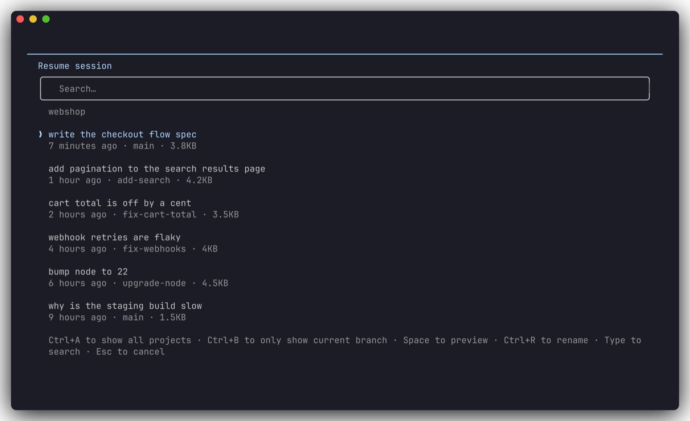
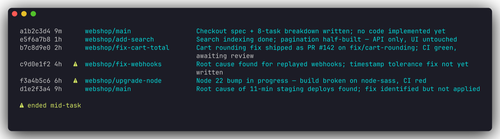
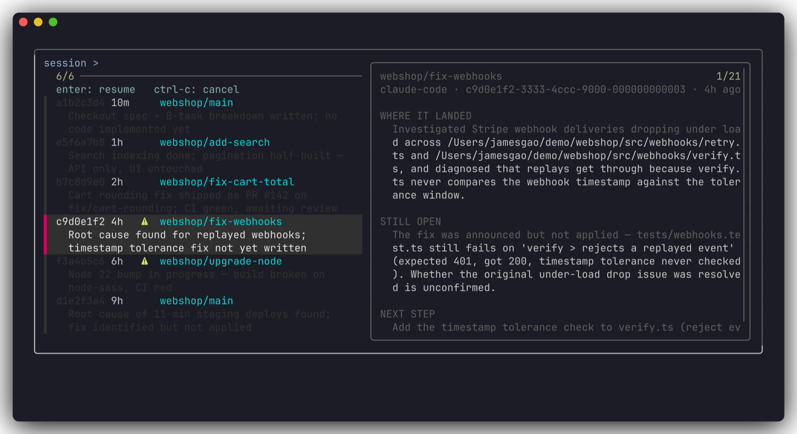

# gmux

**gmux is the giga multiplexer for driving many AI coding agents in tmux —
always-on border labels and a live cockpit tell you what every pane is doing,
so you glance instead of checking each one.** Underneath, `gmux` is also the CLI
that browses, searches, and resumes every agent session you've ever run —
Claude Code, Codex, and whatever you use next.

## gmux: glance, don't check each pane

Running many agents across a tmux workspace has a high **attention tax**: to
know what any pane is doing — and which one needs you — you have to focus each
pane in turn. gmux removes that tax.

Start the daemon once. From then on:

- Every pane's **border** stays labelled with its state and what it's doing,
  repainted continuously — no keypress needed.
- **ctrl+g** pulls up the **cockpit**: the whole workspace in one grid — state,
  memory, one-liner, last activity — with any guardian alerts pinned at the
  top.
- The **memory guardian** watches host memory pressure and, if it gets
  critical, broadcasts a checkpoint-and-pause message into your agent panes
  before the OS starts killing things — only with your consent, disclosed at
  `gmux setup`.

### Quickstart

```bash
gmux tmux install   # add the border + ctrl+g / ctrl+shift+g bindings to ~/.tmux.conf
tmux source-file ~/.tmux.conf

gmux daemon         # start the always-on workspace daemon
```

`gmux daemon` runs in the foreground — leave it in a pane, a background terminal,
or under whatever process supervisor you already use. It's a manual, opt-in
step on purpose: nothing autostarts behind your back. `gmux daemon status` shows
whether it's running; `gmux daemon stop` shuts it down.

Then just work. Borders update on their own; hit **ctrl+g** any time for the
full grid. `gmux setup` is where the guardian's policy is disclosed and chosen —
`auto` (default), `notify`, or `off` — see
[the guardian section of `docs/gmux.md`](docs/gmux.md#the-guardian-one-action-explicit-consent).

### What it looks like

This is real output from gmux's own renderers (`renderCockpit`,
`snapshotLabel`) against a representative workspace snapshot — not a mockup.

**The cockpit grid** (`gmux cockpit`, bound to ctrl+g):

```text
⚠ host memory 92% — top consumer: window `webshop` (4.3 GB); checkpoint your work and pause non-essential tasks.

gmux — 3 panes
○ webshop  idle  [4.3 GB]  10m ago
● webshop  wiring the checkout retry, tests going green  [812 MB]  4s ago
◔ billing  webhook signature fix ready — awaiting your review  [340 MB]  1m ago
  unattributed: 2.1 GB (source outside tracked panes)
```

<!-- screenshot: cockpit grid (drop PNG here) -->

**Pane border labels** — each pane's border shows this, all the time, no
keypress:

```text
● webshop — wiring the checkout retry, tests going green
◔ billing — webhook signature fix ready — awaiting your review
○ webshop — idle
```

<!-- screenshot: pane border labels in a live tmux window (drop PNG here) -->

`●` working · `◔` waiting · `✗` error · `✓` done · `○` idle — the glyph is
instant (no LLM, every tick); the text after it catches up a beat later, once
the semantic layer summarizes.

Full architecture — the two-layer signal, the daemon, memory attribution and
its caveats, the guardian's exact rules — lives in
[`docs/gmux.md`](docs/gmux.md).

## Two lanes: live cockpit vs. session history

gmux's cockpit and gmux's picker answer different questions over the
**same underlying data** — reach for whichever matches what you're asking:

| | **cockpit** — `ctrl+g` / `gmux cockpit` | **picker** — `gmux ls` / `gmux` / `ctrl+shift+g` |
|---|---|---|
| Answers | *What's happening right now, across my live panes?* | *What did I run, and can I get back to it?* |
| Driven by | the daemon, ambient, continuously current | you, on demand |
| Scope | panes open in this tmux workspace | every session on disk, across time |
| Good for | glancing, triage, seeing the guardian log | browsing history, searching, resuming into a new window |

Reach for the cockpit first — it's the ambient layer, always on. Reach for the
picker to go back in time: resume a session from an hour or a month ago,
search across all of them, or check on one that isn't in a live pane right
now. Neither replaces the other.

### The picker, in the same terms as the cockpit

Both of these are looking at one `webshop` repo with six recent sessions. The
built-in picker labels each one with the title Claude Code generated in its
opening seconds; `gmux ls` labels it with where the work actually ended up.

<table>
<tr>
<th width="50%"><code>claude --resume</code></th>
<th width="50%"><code>gmux ls</code></th>
</tr>
<tr>
<td valign="top"></td>
<td valign="top"></td>
</tr>
<tr>
<td valign="top"><em>"webhook retries are flaky" is what you asked for four hours ago. Whether it got fixed is anyone's guess — and the two sessions that died mid-task look exactly like the four that didn't.</em></td>
<td valign="top"><em>The retry fix landed but the timestamp check never got written, and the Node 22 bump left the build red. Both are flagged <code>⚠</code>: they ended mid-task.</em></td>
</tr>
</table>

`gmux` shows a full context card for the highlighted session alongside it — what
landed, what's still open, and the next concrete step. Hit enter and you're
back in the session, in the right harness and the right directory.

<p align="center">
  
</p>

## What makes it different

**Summaries describe what the work became.** gmux reads each
transcript's *arc* — what you originally asked for, how the work moved, your
last instructions, the agent's final message, the files it touched, the last
command that failed — and writes four things: what the session is about, what
landed most recently, what's still open, and the next concrete step. The
harness title names the opening prompt and never revises it; this tells you
where the work actually is. That's the whole point of the tool, and it's what
both the picker and the cockpit's labels are built from.

**It knows when work was cut off.** Sessions that ended mid-task are flagged
`⚠`. Those are usually the ones you're looking for.

**It works across harnesses.** Claude Code and Codex today, with one small
interface for adding more. `gmux resume` hands off to the right CLI — `claude
--resume` or `codex resume` — in the session's original directory.

**Agents can use it too.** Every read command takes `--json`. Your agent can
shell out to `gmux grep "flaky test" --json` to find what you already tried,
instead of asking you.

## Install

**From npm** (recommended):

```bash
npm install -g @gigaflow/gmux
```

The package is published as `@gigaflow/gmux` and installs a single command, `gmux`.

Or run it without installing anything:

```bash
npx @gigaflow/gmux ls
```

**From source** — for hacking on it, or to run an unreleased commit:

```bash
git clone https://github.com/GigaFlowAI/gmux
cd gmux
npm install
npm run build
npm link          # puts `gmux` on your PATH, pointing at this checkout
```

With `npm link`, `gmux` tracks your working copy: re-run `npm run build` and the
next `gmux` picks it up. To run straight from TypeScript without building, use
`npm run dev -- ls`. To unlink later: `npm unlink -g @gigaflow/gmux`.

Requires Node 20+. Three optional companions, all surfaced by `gmux doctor`:

- **ripgrep** (`brew install ripgrep`) — needed for `gmux grep`.
- **fzf** (`brew install fzf`) — upgrades the picker to fuzzy search with a preview pane. Without it you get a numbered list.
- **tmux 3.2+** (`brew install tmux`) — needed for gmux (borders, cockpit) and the `ctrl+shift+g` picker popup; see [gmux](#gmux-glance-dont-check-each-pane) above.

Summaries are written by a model, so the first time you run `gmux` it asks which
one to call — Claude Code, Codex, anything that reads a prompt on stdin, or
nothing at all. Change your mind any time with `gmux setup` — the same wizard
also discloses and sets the [gmux guardian's policy](docs/gmux.md#the-guardian-one-action-explicit-consent).
`GMUX_SUMMARY_CMD='codex exec'` overrides it for a one-off, and nothing
prompts when the output isn't a terminal, so `gmux ls --json` stays safe to
script.

## Usage

```bash
gmux                       # pick a recent session and resume it
gmux ls                    # recent sessions, newest first
gmux ls -p webshop -s 3d   # ...in one project, from the last 3 days
gmux show <id>             # the full context card (id or any unique prefix)
gmux grep "rate limit"     # full-text search every transcript
gmux ask                   # ask about your sessions — what to pick up, and why
gmux resume <id>           # jump back in, in the right harness and directory
gmux summarize --recent 20 # write summaries for the 20 most recent sessions, now
gmux setup                 # choose which harness gmux calls, and the guardian policy
gmux doctor                # what's installed, what's missing, how to fix it

gmux tmux install          # add the ctrl+g / ctrl+shift+g / alt-g tmux bindings
gmux daemon                # start the gmux workspace daemon (borders + cockpit)
gmux cockpit               # the live workspace grid — normally launched via ctrl+g
gmux run claude            # launch an agent gmux can map to its pane exactly

gmux --no-auto-summarize ls   # ...without kicking off background summaries
```

Summaries are cached and only regenerate when a session actually changes, so
you pay for each one once.

By default the list hides two kinds of noise: **subagent transcripts**
(`--include-sidechains`) and **non-interactive runs** like `claude -p` or
`codex exec` (`--include-automated`).

## Ask across your sessions

A list answers "what was I doing?" one row at a time. `gmux ask` answers the
question that spans them: *given all of it, where should I be looking?*

```bash
gmux ask                                  # a conversation; ctrl-d to leave
gmux ask "what's still broken?"           # one-shot
gmux ask "what did I try for the retry?" --json   # for your agents
```

It starts from the summaries already on disk — so it costs one model call, not
a scan of half a gigabyte. When the summaries don't carry enough, it runs `gmux
grep` against the real transcripts and reads what you actually said.

**In the picker, `ctrl-o` opens it** on the session you're highlighting: ask
"what's left here?", read the answer, and land back in the list exactly where
you were. (Without fzf, the numbered list spells it `a`.)

It isn't `shift+f` because fzf's query line eats plain letters — typing `F`
types an `F`. And it isn't `alt-a` because macOS sends `å`.

## Summaries write themselves

Every `gmux` command keeps **the sessions you just looked at** summarized. `gmux
ls` shows 20 by default, so it keeps 20 written; `gmux ls -n 50` keeps all
fifty. Any that are missing or stale are handed to a **detached background
process**, eight at a time, and the command returns immediately:

```
$ gmux ls
a1b2c3d4 3m    webshop/main            Checkout spec + 8-task plan written; no tasks executed yet
e5f6a7b8 1h  ◐ webshop/add-search      add pagination to the search results page
c9d0e1f2 4h  ⚠ billing/fix-webhooks    Retry logic half-applied; signature test still red

⚠ ended mid-task   ◐ summarizing now (1)
summarizing 1 session in the background — marked ◐ below
```

| marker | meaning |
|---|---|
| `◐` | being summarized right now |
| `○` | no summary yet, and nothing running |
| `⚠` | the session ended mid-task — usually the one you want |

The foreground command **never waits on a model**: it prints and exits, and
the summaries appear on your next run. Only one background pass runs at a time
— a lock in `~/.cache/gmux` means five `gmux ls` in a row start one
summarizer, not five. A pass writes at most 50; the rest are picked up next
run, and it says so.

The notice goes to **stderr**, so `gmux ls --json` stays clean for agents and
pipes.

Automated runs and sidechains are never summarized this way. That matters: the
summarizer *is* `claude -p`, which writes a session of its own — summarizing
those would put gmux in an infinite loop against your token budget.

**Turning it off.** Background model calls cost tokens. Either of these
switches them off:

```bash
gmux --no-auto-summarize ls          # once
export GMUX_AUTO_SUMMARIZE=0 # for good, in your shell profile
```

It also stays quiet if no summary provider is installed — a missing `claude`
never breaks a read command. If a background pass fails, `gmux doctor` shows you
the last error rather than leaving you to wonder why nothing appeared.

## tmux bindings, in full

`gmux tmux install` writes three bindings to `~/.tmux.conf` (`gmux tmux uninstall`
removes them; reload with `tmux source-file ~/.tmux.conf` after either):

- **ctrl+g** — pulls up the gmux **cockpit** in a full-screen popup: every
  pane's state, memory, headline, and last activity, with the guardian log at
  the top. Reads the daemon's live socket while `gmux daemon` is running, and
  falls back to the last snapshot file (marked stale) when it isn't. Press
  **ctrl+g** again (or Esc) to dismiss — the same key toggles it.
- **alt-g** — toggles a lighter-weight label loop that keeps pane borders
  headlined from your cached session summaries, for when you're not running
  `gmux daemon`. With the daemon running, borders are already kept current from
  the live workspace model — `gmux daemon`'s output is the primary path
  described in [gmux](#gmux-glance-dont-check-each-pane) above.
- **ctrl+shift+g** — opens the `gmux` session picker in a popup; Enter resumes
  your choice into a **new tmux window**, so the pane you were in stays
  untouched. See [Two lanes](#two-lanes-live-cockpit-vs-session-history).

`gmux` resolves which session a pane is running by reading the pane's own
process (the agent's command line carries its session id) — so it works with
panes you already have open, no setup. Launching through `gmux run` records an
exact link for the rare cases the process can't be read:

```bash
gmux run claude         # instead of: claude
gmux run codex resume   # instead of: codex resume
```

This needs **tmux 3.2 or newer** (for `display-popup`); `gmux doctor` reports
whether it's available and, if not, why.

## How it works

```
harness dirs → adapter → SessionRecord (hard facts, free)
                       → index cache   (mtime-keyed; 1,100 sessions in ~60ms warm)
                       → distill arc   → model → summary (cached)
```

gmux is **read-only** over your session transcripts. It never writes to
a session file; it owns nothing but its own cache in `~/.cache/gmux` and
gmux's small daemon state.

See [`docs/architecture.md`](docs/architecture.md) for the layering,
[`docs/gmux.md`](docs/gmux.md) for gmux's daemon/model/surfaces design, and
[`docs/adding-a-harness.md`](docs/adding-a-harness.md) to add support for
another agent.

## Contributing

Yes please — especially adapters for other harnesses. Start with
[`CONTRIBUTING.md`](CONTRIBUTING.md).

## License

MIT
