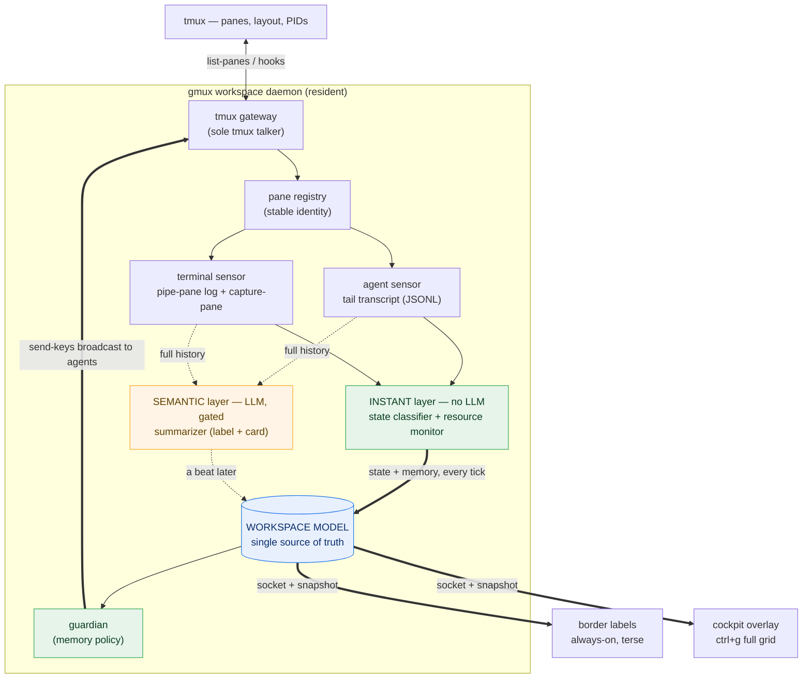
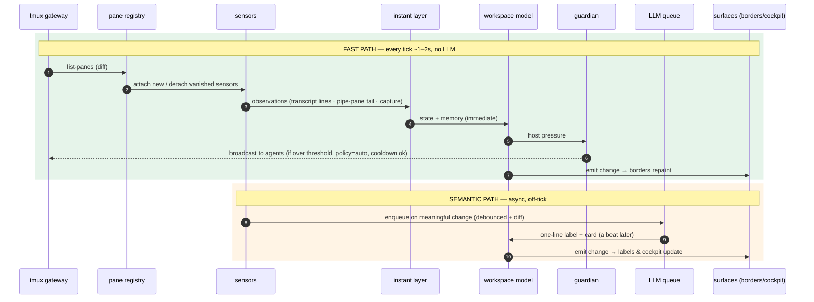
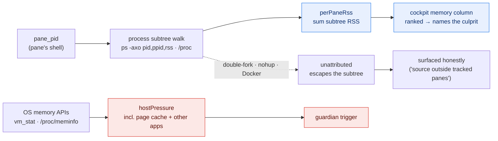
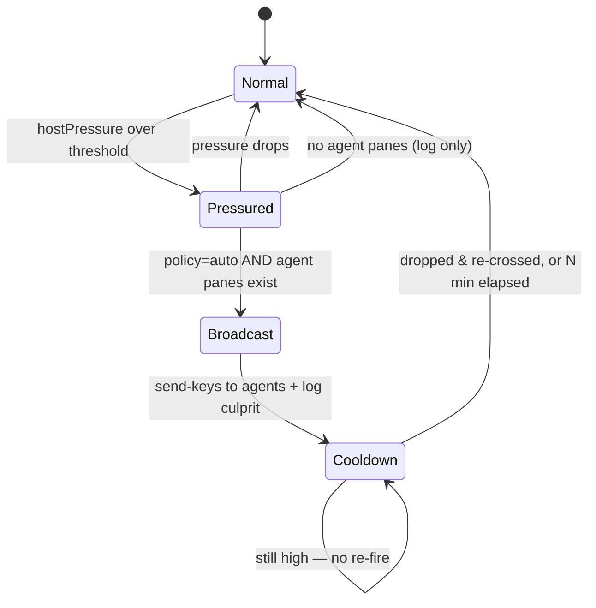

# gmux — LLM-native terminal multiplexer awareness layer

**Date:** 2026-08-11
**Status:** Design approved, pending spec review
**Name:** gmux ("giga multiplexer" — tmux, but LLM-native). The product, the repo, the npm package (`@gigaflowai/gmux`), and the single command are all `gmux`. The earlier `gm` / `gigamanage` names are retired.

## Problem & core job

Running many AI coding agents across a tmux workspace has a high **attention tax**: to know what any pane is doing — and which one needs you — you have to focus each pane in turn. Built-in tools show process state at best; nothing tells you *what the work is* at a glance, across everything.

> **Core job: gmux lowers your attention tax — glance at the workspace and instantly understand what every pane is doing, without checking each one.**

This is an *ambient awareness* product, not a command you invoke. It builds directly on gmux's existing pieces: cross-harness transcript adapters, LLM summaries (`summarize`/`distill`/`auto-summarize`), tmux pane-border labels (`alt-g`), and in-place overlay cards (`ctrl+g`). gmux promotes the LLM from **annotating** the multiplexer to **operating** it — continuously, and with one protective automated action (the memory guardian).

## Product trajectory (revised 2026-08-11)

The awareness layer is the *wedge*, not the ceiling. The long-term product is an **LLM-native developer terminal**: it manages your agents, helps you navigate context across many streams of work, *and* manages how that work is displayed — reorganizing panes, windows, and layout on request and, over time, to fit how you work. We get there in two deliberate stages, and we do **not** fork tmux to do it.

- **Stage A — own the *launch*, drive the *runtime* (near-term).** `gmux` becomes the entry point: it bootstraps config + key bindings + the daemon, then launches into a tmux workspace it drives via [control mode](https://github.com/tmux/tmux/wiki/Control-Mode) and the tmux command API. It owns how every pane/agent is *launched* (a per-pane wrapper), which unlocks exact memory attribution, lifecycle control, and — on Linux — cgroup v2 isolation with an enforceable `memory.max`. And it adds an **LLM control layer**: reorganize the workspace by conversation (`split-window`, `select-layout`, `swap`/`move`/`join`/`break-pane`, `resize-pane`). Stock tmux stays the battle-tested multiplexer core; nothing here requires patching tmux.
- **Stage C — own the *runtime* (future bet).** The two capabilities stock tmux genuinely cannot express — **native chrome woven into the grid** (beyond borders + popups) and **live output interception/transformation** (not just `pipe-pane`'s copy) — require owning the PTYs and rendering. When that bet is made, gmux builds or embeds a **modern, programmable multiplexer core** (e.g. Rust `portable-pty` + a `vte` grid parser, the path Zellij took) designed LLM-native from the ground up. **We explicitly reject forking tmux** ("Stage B"): a fork pays the full cost of owning a runtime while inheriting a decades-old C architecture shaped around a human pressing prefix-keys — all cost, none of the clean foundation the long-term product needs.

Sequencing: Stage A validates the novel, riskiest part (does reorganize-by-conversation actually feel good?) cheaply on a stable core; Stage C is committed only after that interaction model is proven. The rest of this document specifies the awareness layer that underpins both.

## Scope

**In scope:** continuous, always-on understanding of *every* pane (agent and non-agent), across a two-layer signal (instant heuristic state + change-gated LLM semantics), surfaced on always-on borders and a pull-up cockpit; per-pane memory attribution; an auto-broadcasting memory guardian that protects agents under host memory pressure.

**Out of scope for *this* spec (see Product trajectory):** the launcher/bootstrap, per-pane launch ownership, cgroup isolation, and the LLM control layer are **Stage A** — the next milestone, not this one. Native chrome and live output interception are **Stage C**. This spec is the awareness layer both stages build on: within it, the guardian is the single, well-contained taste of "acting," and gmux still *drives* stock tmux rather than owning PTYs.

## Approach (chosen: two-layer sensing)

You cannot run an LLM continuously on every pane — too slow, too expensive. The signal is therefore split:

- **Instant layer (no LLM):** local heuristics classify each pane's state (`working | idle | waiting | error | done`) and read memory every tick, in milliseconds. This is the triage-critical signal and it is always fresh.
- **Semantic layer (LLM, change-gated + debounced):** the human-readable "what it's doing" one-liner and full card, refreshed only on meaningful change, fed full history.

**Governing invariant:** the fast path (state, memory, guardian) must survive anything the slow path (LLM) or tmux does. LLM failure degrades label freshness only — never triage or the memory guardian.

## Architecture

One long-lived **workspace daemon** maintains a single in-memory **workspace model** (the authoritative "what is every pane doing now") and pushes it to display surfaces. Everything else feeds into, or reads from, that model.

*Green = fast path (no LLM, every tick). Amber = slow path (LLM, gated). Blue = the model everything reads. Bold arrows are the guaranteed-fast flow; dashed arrows lag by design.*

**Principles**

1. **One model, many views.** Surfaces render the model; they never sense. New surfaces cost nothing in sensing.
2. **Two-speed signal.** State/memory are stored separately from semantics, so a pane can flip to `waiting` instantly while its label text catches up.
3. **Stable pane identity.** Each pane maps to a durable id (tmux `pane_id` + resolved harness/session), reusing `pane-links` / `tmux-resolve` / `fingerprint`, so history and model entries survive re-layout.
4. **Resident daemon.** The shift from today's invoke-on-keypress model to a persistent daemon is what makes "always current" possible — and memory monitoring requires it anyway. Keybinding surfaces become thin clients that read the model.

## Components

Each unit has one job, a defined input/output, and is testable alone.

| Component | Responsibility | New / Reuses |
|---|---|---|
| **tmux gateway** | Sole talker to tmux: `list-panes` (+ `pane_id`/`pane_pid`/window/active), `capture-pane`, `pipe-pane` setup, `send-keys` (broadcast), hooks. Isolates tmux quirks; the master test seam. | extends `services/tmux.ts` |
| **Pane registry** | Live tmux panes → durable records; resolves harness/session for agent panes; tracks appear/disappear. | reuses `pane-links`, `tmux-resolve`, `fingerprint` |
| **Sensors** (per pane) | Emit a uniform *observation* regardless of source. *Agent sensor* tails transcript; *terminal sensor* manages `pipe-pane` log + `capture-pane` tail. | agent reuses `adapters/*`; terminal sensor new |
| **State classifier** | Pure heuristics over the latest observation → `working \| idle \| waiting \| error \| done`. No LLM, deterministic. | new (`services/pane-state.ts`) |
| **Resource monitor** | Walk process subtree from `pane_pid`, sum RSS; read host memory pressure from OS. Emits `{perPaneRss, hostPressure, unattributed}`. No LLM. | new (`services/resources.ts`) |
| **Semantic summarizer** | Change-gated, debounced LLM call → one-line label + card, fed full history. | reuses `summarize`/`distill`/`auto-summarize` |
| **Workspace model** | Single source of truth: per-pane `{identity, state, semantics, resources, ts}` + workspace `{memPressure, guardianLog}`. Emits change events. | new (`services/workspace.ts`), may lean on `index-store` |
| **Guardian** | Policy engine: watch model for host memory thresholds → broadcast to agent panes via gateway + record action. Config: off/notify/auto, threshold, cooldown, hysteresis. | new (`services/guardian.ts`) |
| **Daemon** | Loop tying sensors → classifiers → model; owns cadence, debounce, concurrency, lifecycle. Exposes model over unix socket + snapshot file. | new (`services/daemon.ts` + `gmux daemon`) |
| **Render surfaces** | Thin clients that read the model and paint: **borders** (terse) and **cockpit** (ctrl+g grid). Sense nothing. | reuse `tmux-label`, `overlay`/`overlay-ask` |
| **Config** | Thresholds, cadence, autonomy policy, LLM provider — disclosed at `gmux setup`. | extends `services/config.ts` |

**Daemon↔surface boundary:** the daemon owns a **local unix socket** (surfaces subscribe/read) plus a **snapshot file** written each tick (fallback when the daemon is down). Same shape as a queryable API if agents/plugins ever need to read gmux.

## Data flow

**Daemon tick (~1–2s, cheap):**
1. **Discover** — gateway `list-panes`; registry diffs. New panes get a sensor + `pipe-pane` log; vanished panes marked gone then evicted.
2. **Observe** — each sensor pulls its latest slice (new transcript lines; or `pipe-pane` tail + `capture-pane`).
3. **Classify (instant, no LLM)** — state classifier + resource monitor run on every pane; results land in the model immediately. Guaranteed fast path; never blocks on the LLM.
4. **Guardian check** — recompute host pressure; if over threshold, cooldown elapsed, and policy = auto, broadcast and log.
5. **Emit** — on change, bump model version and notify subscribers over the socket; borders repaint.

**Semantic path (async, off the tick):** meaningful observation change (debounce + cheap diff) enqueues the pane; a bounded worker pool (`concurrency.ts`) calls the summarizer with full history and writes the label/card back. Semantics arrive a beat after state — by design.

**Read path:** borders repaint from model changes (daemon-driven `tmux-label`). Cockpit (`ctrl+g`) launches the overlay client, reads the socket snapshot, renders the full grid (per pane: state, memory, one-liner, last activity; guardian log at top), subscribes while open, exits.

**Key property:** state/memory latency is bounded by the tick (LLM-independent); semantic latency by debounce + queue.

## Memory attribution

*Two distinct signals from one component: `perPaneRss` answers "who's the hog" (blue, ranking); `hostPressure` is what the guardian fires on (red, trigger). They are not the same number.*

tmux gives each pane a `pane_pid` (its shell). Everything run in the pane is a descendant. The resource monitor builds the parent→child tree (`ps -axo pid,ppid,rss,comm` on macOS; `/proc` on Linux) and sums RSS over each pane's subtree — ranking panes answers "who's the culprit."

**Two distinct signals, one component:**
- **`perPaneRss`** — per-pane subtree RSS, for attribution/ranking (cockpit memory column, culprit naming).
- **`hostPressure`** — read directly from the OS (`vm_stat`/`sysctl` on macOS, `/proc/meminfo` on Linux); the guardian's trigger. Includes page cache and all other apps, so it is *not* the sum of panes.
- **`unattributed`** — memory not accounted to any pane subtree.

**Caveats (designed around, not hidden):**
1. **RSS double-counts shared pages** → reliable for ranking, not for exact totals. (Linux PSS/`smaps_rollup` is a later precision upgrade.)
2. **Detached/containerized children escape the subtree** (double-fork to init, `nohup`, Docker under the docker daemon). That memory shows as `unattributed`, surfaced honestly rather than mis-attributed.
3. **`hostPressure` ≠ sum of panes** — measured separately, as above.

**Stronger isolation (Stage A):** on Linux, spawning each pane's shell in its own cgroup v2 scope gives exact accounting *and* enforceable `memory.max`. That requires gmux to own how panes are launched — which is exactly what Stage A adds — and doesn't exist on macOS, so the portable mechanism *this* layer relies on is the `pane_pid` subtree walk.

## Guardian behavior

The guardian is the one component that **acts** (types into agents), so it gets the strictest rules.

- **Default policy: `auto-broadcast`**, but **`gmux setup` discloses this prominently** and offers `notify-me-only` / `off` at install time — consent is explicit, not buried.
- **Only broadcasts to known agent panes** — never arbitrary shells (injecting keystrokes where a human is typing would corrupt input).
- **Cooldown + hysteresis:** fire at threshold, then stay quiet N minutes; don't re-fire until pressure drops and re-crosses (or an escalation level is hit). No spamming while memory sits high.
- **No target, no action:** with no agent panes, log the pressure, send nothing.
- **Names the culprit:** broadcast/log includes the top consumer, e.g. *"host memory 92% — top consumer: window `webshop-build` (4.2 GB); checkpoint your work and pause non-essential tasks."* If the hog is `unattributed`, say so honestly.
- **Every action logged** to the model (timestamp, pressure, culprit); the cockpit shows it. Policy always honored.

## Error handling & edge cases

- **LLM slow/down** → semantics stale with a marker; failed summaries retried with backoff; fast path unaffected.
- **tmux down / gateway error** → daemon idles and retries; surfaces show "daemon not connected."
- **Pane appears/vanishes mid-tick** → registry diff is sole authority; vanished `pane_id` is normal, never a crash; sensor + `pipe-pane` torn down on close.
- **`pipe-pane` log growth** → per-pane logs size-capped (rotation, keep last N MB), pruned on pane close. Agent history comes from the transcript, so caps only bound the non-agent tail.
- **Daemon crash** → model is derived state (transcripts + pane logs are durable inputs); daemon is supervised (`gmux daemon`/launchd) and rebuilds. Snapshot file lets surfaces render "stale Ns ago" and offer to start it.
- **Socket unavailable** → surfaces fall back to snapshot file, clearly marked stale.
- **Cost control** → bounded LLM queue prioritizing active/visible panes; stale pending requests coalesce so an output burst can't fan out into a cost spike.

## MVP phasing

- **Phase 0 — Skeleton:** daemon, tmux gateway, workspace model, socket + snapshot, borders driven by daemon using **state only** (heuristics, zero LLM). Proves the always-on loop.
- **Phase 1 — Attention-tax core:** semantic summarizer (reuse), full state taxonomy, cockpit grid (grow `ctrl+g`). Delivers the wedge.
- **Phase 2 — Memory guardian:** resource monitor, guardian policy + broadcast + `gmux setup` disclosure, cockpit memory column + culprit naming.
- **Phase 3 — Hardening:** log rotation, LLM-queue prioritization, staleness UX, config polish.

## Testing strategy

- **Fake tmux gateway** is the master seam: scripted `list-panes`/`capture-pane`, recorded `send-keys` → the whole daemon runs headless, no real terminal.
- **State classifier / resource monitor / guardian** are pure over fixtures: pane-content samples → expected state; synthetic `ps` trees → expected attribution + `unattributed`; guardian as a state machine with a fake clock + fake broadcast sink (threshold, cooldown, hysteresis, no-target, policy-off).
- **LLM mocked;** a test stubs the summarizer to *hang* and asserts the fast path stays live — the decoupling invariant, enforced.
- **Sensors:** transcript parsing reuses existing adapter tests; terminal sensor tested against fixture `pipe-pane` logs.
- **Workspace model:** diff/version/emit correctness.

## Open questions / future

- Escalation ladder for the guardian (nudge → warning → name-and-shame) — deferred; single message for MVP.
- Extending the instant layer to CPU (trivial once memory attribution exists).
- Stage A ("own the launch"): launcher/bootstrap, per-pane launch wrapper, cgroup isolation, and the LLM control layer (reorganize-by-conversation) — the next milestone, built on this awareness layer. Deserves its own spec.
- Stage C ("own the runtime"): native chrome + live output interception via a modern, embedded/built multiplexer core — not a tmux fork. A future bet, taken only after Stage A proves the interaction model.
- Whether to expose the daemon socket as a public API for agents/plugins to query gmux.
